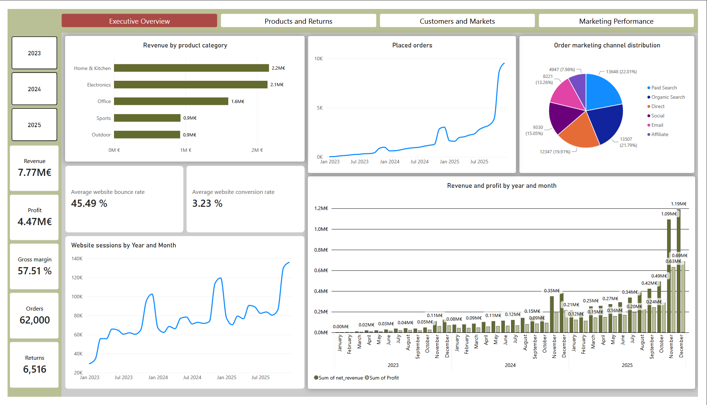
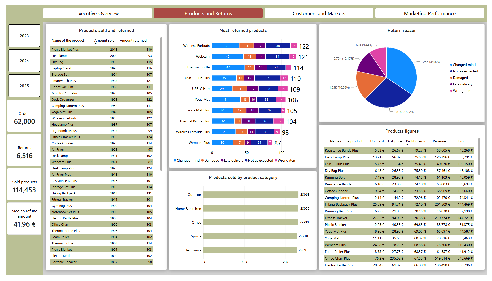
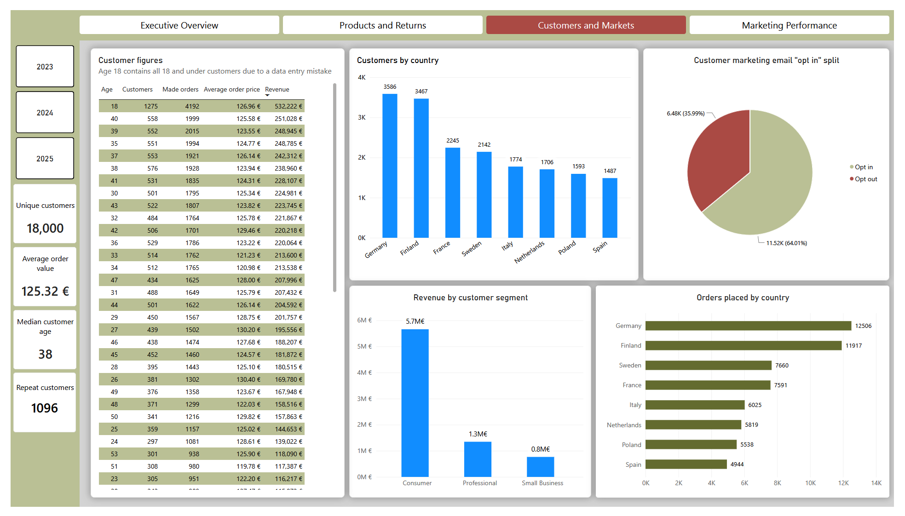
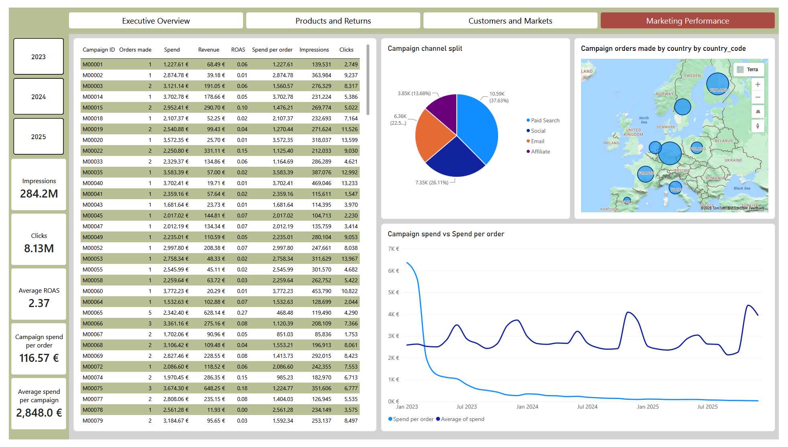

# End-to-End E-commerce Business Intelligence Project

An end-to-end Business Intelligence portfolio project built around a synthetic European e-commerce dataset.

The project demonstrates practical skills in Python, pandas, SQL, SQLite, Power BI, data cleaning, validation, relational modelling, business analysis and dashboard development.

## Project overview

The objective was to build a complete analytics workflow from deliberately messy raw data to a finished Power BI dashboard.

The project includes:

- raw-data profiling and investigation with Python
- reproducible cleaning and validation with pandas
- relational database design in SQLite
- SQL analysis of revenue, profit, customers, products, returns and marketing campaigns
- interactive Power BI dashboards
- documentation of data-quality findings and project decisions

## Dataset

The synthetic dataset contains:

- 18,000 customers
- 62,000 orders
- 114,453 order items
- 60 products
- 1,152 marketing campaigns
- 6,516 returns
- 8 European markets
- data from 2023 to 2025

## Project architecture

Raw data
→ Python profiling
→ Python cleaning and validation
→ SQLite database
→ SQL analysis
→ Power BI dashboard
→ Business insights

## Data quality

The raw dataset deliberately contained issues such as:

- duplicate customer records
- missing values
- inconsistent country and marketing-channel formatting
- mixed date formats
- missing product brands
- missing discount values

During analysis, an artificial concentration of customers aged 18 was also identified. This was traced to the synthetic data-generation process and documented as a limitation.

## SQL analysis

The SQL layer answers business questions including:

- monthly revenue and profit
- sales by country
- product performance
- return rates
- customer segment performance
- campaign conversion rate
- cost per purchase
- ROAS

## Power BI dashboard

The report contains four pages:

1. Executive Overview
2. Products and Returns
3. Customers and Markets
4. Marketing Performance

## Dashboard preview

## Key learning outcomes

This project strengthened my understanding of:

- data profiling and validation
- data cleaning pipeline
- SQL joins and aggregation grain
- relational database design
- Power BI measures and filter context
- KPI selection and dashboard design
- identifying anomalies instead of blindly trusting data